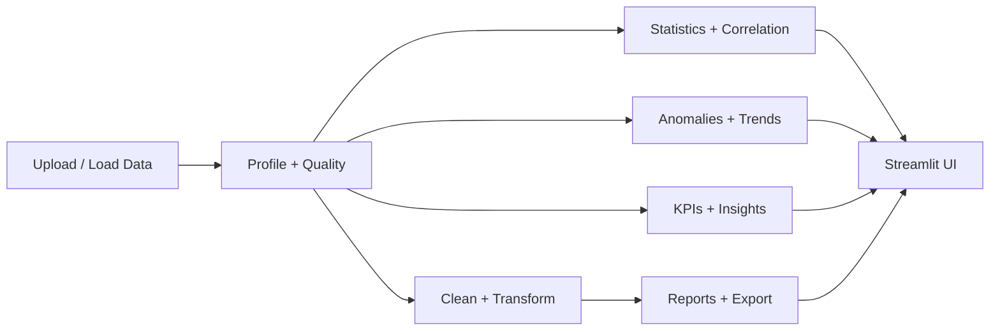

# DataLens AI

DataLens AI is a rule-based, statistical data quality and analytics platform for tabular datasets. It profiles columns, scores data quality, supports cleaning workflows, and produces descriptive analysis, potential anomaly flags, KPIs, insights, and exportable reports. Results come from explicit calculations and configurable rules; the application does not use generative AI.

## Live Demo

[Open the DataLens AI demo](https://your-streamlit-app.streamlit.app/) (placeholder link; replace with the deployed app URL).

## Screenshots

- Home: `screenshots/home.png` (placeholder)
- Overview: `screenshots/overview.png` (placeholder)
- Analysis: `screenshots/analysis.png` (placeholder)

## Features

- CSV, Excel, and JSON ingestion with validation
- Column profiling and quality scoring
- Audited cleaning operations
- Descriptive statistics, correlations, and trend summaries
- Potential anomaly detection and KPI identification
- Traceable insights and recommended actions
- PDF, Excel, and CSV exports

## How the Quality Score Works

The score combines rule-based data quality dimensions and detected issues. See [METHODOLOGY.md](METHODOLOGY.md) for the scoring approach, dimensions, and interpretation.

## Limitations

- Data is processed in memory and is not persisted by the application.
- Sampling above 200,000 rows is not consistent across analysis workflows; some operations process the full dataset and may use substantial memory.
- Anomaly results are potential anomalies for review, not evidence of fraud or wrongdoing.
- Correlation is not causation.
- Quality scores are indicators based on the available rules and fields, not guarantees of real-world accuracy.

## Roadmap

- Evaluate optional machine-learning-based anomaly detection alongside the current rule-based methods.

## Local Setup

Use Python 3.12, matching the deployment runtime:

```bash
python -m venv .venv
source .venv/bin/activate  # Windows: .venv\Scripts\activate
pip install -r requirements.txt
streamlit run app.py
```

Install development dependencies and run tests with:

```bash
pip install -r requirements-dev.txt
python -m pytest -q
```

## Deployment

Deploy on Streamlit Community Cloud with Python 3.12 and set the main file path to `app.py`. The configured maximum upload size is 200 MB.

For Docker:

```bash
docker build -t datalens-ai .
docker run -p 8501:8501 datalens-ai
```

## Architecture



## License

DataLens AI is released under the [MIT License](LICENSE).
