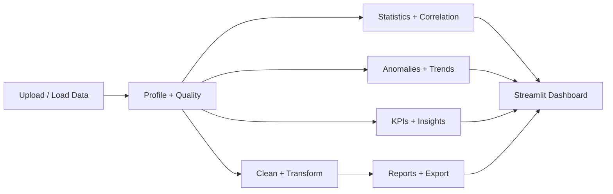

# DataLens AI

DataLens AI is a Streamlit-based analytics platform for data quality assessment, profiling, anomaly detection, KPI tracking, and AI-style insight generation from tabular business datasets.

## Features

- Dataset upload and validation for CSV, Excel, and JSON
- Automatic profiling and quality scoring
- Data cleaning and transformation audit trail
- Statistical analysis with plain-English interpretation
- Anomaly detection and trend review
- KPI identification and summary cards
- Insight generation and recommendation engine
- PDF, Excel, and CSV export workflows
- Responsive enterprise analytics UI

## Architecture



## Local setup

```bash
python -m venv .venv
source .venv/bin/activate  # Windows: .venv\Scripts\activate
pip install -r requirements.txt
streamlit run app.py
```

## Running tests

```bash
python -m pytest -q
```

## Docker

```bash
docker build -t datalens-ai .
docker run -p 8501:8501 datalens-ai
```

## Deployment options

- Streamlit Community Cloud
- Hugging Face Spaces
- Render
- Azure App Service or container-based hosting

## Notes

- Data is processed in memory and remains isolated to the session.
- Synthetic demo data is clearly labeled as such.
- All metrics shown in the app come from the loaded dataset and are intended to be traceable to real calculations.
