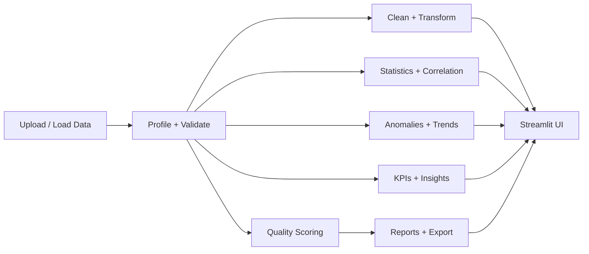

# Automated Data Quality and Analytics Platform

The Automated Data Quality and Analytics Platform is a rule-based data operations solution for profiling, validating, cleaning, and analyzing tabular datasets. It helps teams assess data health, detect anomalies, uncover trends, and turn raw data into actionable business insights through a streamlined Streamlit interface.

This project is designed for organizations that need a transparent, explainable, and auditable analytics workflow without relying on opaque black-box models. It combines ingestion, validation, profiling, quality scoring, anomaly detection, KPI tracking, and reporting in a single platform.

## Live Demo

[Open the platform demo](https://your-streamlit-app.streamlit.app/) (placeholder link; replace with the deployed app URL).

## Screenshots

- Home: `screenshots/home.png` (placeholder)
- Overview: `screenshots/overview.png` (placeholder)
- Analysis: `screenshots/analysis.png` (placeholder)

## Key Features

- CSV, Excel, and JSON ingestion with validation and metadata capture
- Column profiling and automated data quality scoring
- Cleaning workflow with traceable, auditable transformations
- Descriptive statistics, correlations, and trend summaries
- Anomaly detection for unusual values and outliers
- KPI monitoring and business-facing insights
- Exportable reports in PDF, Excel, and CSV formats
- Explainable rule-based analysis for trustworthy operational decisions

## How the Quality Score Works

The quality score is calculated from rule-based checks and detected issue patterns across the dataset. The scoring methodology, dimensions, and interpretation are documented in [METHODOLOGY.md](METHODOLOGY.md).

## Why This Platform

Modern data teams need more than static dashboards. They need a practical system for:

- validating incoming data before downstream reporting
- reducing manual cleanup effort with guided workflows
- identifying quality issues early in the data lifecycle
- measuring business performance using KPI and trend analysis
- producing evidence-based insights with clear reporting

## Limitations

- Data is processed in memory during the session and is not persisted by the application.
- Very large datasets may require additional memory and may affect processing speed.
- Detected anomalies are potential issues for review, not proof of a business problem.
- Correlation does not imply causation.
- Quality scores reflect the rules and fields available in the platform and should be used as decision support rather than absolute truth.

## Roadmap

- Expand rule libraries and validation coverage
- Evaluate optional machine-learning anomaly methods alongside the current rule-based engine
- Improve export customization and reporting templates

## Local Setup

Use Python 3.12 to match the deployment runtime:

```bash
python -m venv .venv
source .venv/bin/activate  # Windows: .venv\Scripts\activate
pip install -r requirements.txt
streamlit run app.py
```

Install development dependencies and run the test suite:

```bash
pip install -r requirements-dev.txt
python -m pytest -q
```

## Deployment

Deploy on Streamlit Community Cloud using Python 3.12 and set the main app file to `app.py`. The configured upload limit is 200 MB.

For Docker:

```bash
docker build -t automated-data-quality-platform .
docker run -p 8501:8501 automated-data-quality-platform
```

## Architecture



## Project Structure

- `app.py` – Streamlit application entry point
- `core/` – data ingestion, profiling, quality, statistics, trends, and reporting logic
- `ui/` – page layouts, navigation, and dashboard presentation
- `data/` – demo datasets and generated sample data
- `tests/` – automated validation for ingestion, profiling, cleaning, and analytics workflows

## License

This project is released under the [MIT License](LICENSE).
